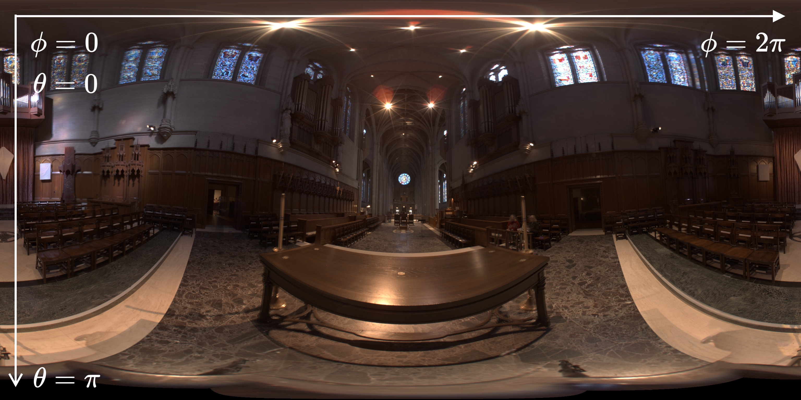
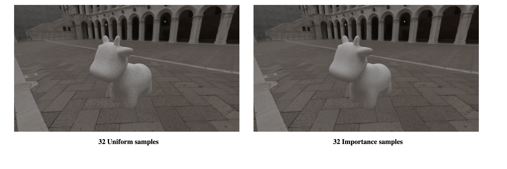
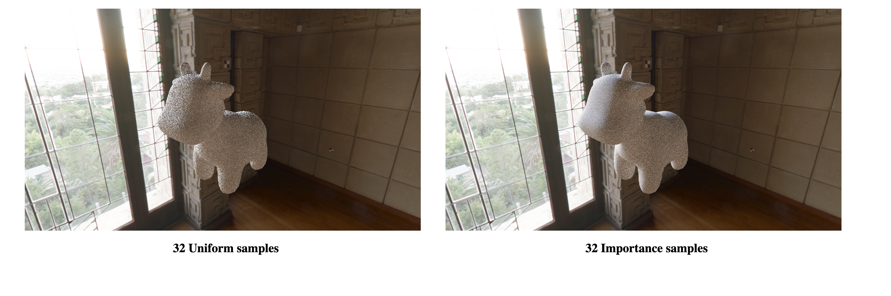
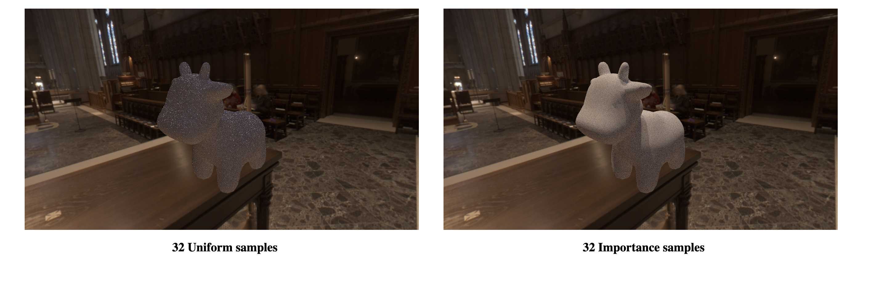

# `A3T7` Environment Lighting

The final task of this assignment will be to implement a new type of light source: an infinite environment light. An environment light is a light that supplies incident radiance (really, the light intensity $\frac{d\Phi}{d\Omega}$) from all directions on the sphere. Rather than using a predefined collection of explicit lights, an environment light is a capture of the actual incoming light from some real-world scene; rendering using environment lighting can be quite striking.

The intensity of incoming light from each direction is defined by a texture map parameterized by phi and theta, as shown below.

In this task you will get `Environment_Lights::Sphere` working by implementing `Samplers::Sphere::Uniform` and `Samplers::Sphere::Image` in `src/pathtracer/samplers.cpp`. You'll start with uniform sampling to get things working, and then move onto a more advanced implementation that uses **importance sampling** to significantly reduce variance in rendered images.

Note that for the purposes of this task, (0,0) is actually the **bottom left** of the HDR image, not the **top left**. Think about how this will affect your calculation of the $\theta$ value for a pixel.

---

## Step 0: Know your customers

First, check out the interface and implementation of `Environment_Lights::Sphere` in `src/scene/env_light.h`/`.cpp`. Particularly, path attention to how it initializes and uses its member `importance` to sample directions from an `HDR_Image`, which it also passes to the constructor of `importance`. (The `HDR_Image` interface may be found in `util/hdr_image.h`.)

## Step 1: Uniformly sampling the environment map

Implement `Sphere::Uniform::sample` in `src/pathtracer/samplers.cpp`.

In order to test uniform sampling, make sure that the variable `IMPORTANCE_SAMPLING` at the top of `src/pathtracer/samplers.cpp` is set to false.

This should be sufficient to get environment maps working in the renderer (albeit in a high-variance / slow-convergence way).

Since high dynamic range environment maps can be large files, we have not included them in the Scotty3D repository. You can download a set of sample environment maps [here](http://15462.courses.cs.cmu.edu/fall2015content/misc/asst3_images/asst3_exr_archive.zip) or -- for more interesting environment maps -- check out [poly haven](https://polyhaven.com/hdris).

To use a particular environment map with your scene, select `layout` -> `Create Object` -> `Environment Light Instance`, then set the underlying `Light` type to `Sphere`, add a new `Texture`, set the texture type to `Image` and, finally, press `Change` and select your file. Make sure that you have the variable `SAMPLE_AREA_LIGHTS` set to be false to ensure that you're not importance sampling.

## Step 2: Importance sampling the environment map

Much like light in the real world, most of the energy provided by an environment light source is concentrated in the directions toward bright light sources. Therefore, it makes sense to prefer sampling directions for which incoming radiance is the greatest. For environment lights with large variation in incoming light intensities, good importance sampling will significantly reduce the variance of your renderer.

The basic idea of importance sampling an image is assigning a probability to each pixel based on the total radiance coming from the solid angle it subtends.

A pixel with coordinate $\theta = \theta_0$ subtends an area $\sin\theta d\theta d\phi$ on the unit sphere (where $d\theta$ and $d\phi$ are the angles subtended by each pixel as determined by the resolution of the texture). Thus, the flux through a pixel is proportional to $L\sin\theta$. (Since we are creating a distribution, we only care about the relative flux through each pixel, not the absolute flux.)

**Summing the flux for all pixels, then normalizing each such that they sum to one, yields a discrete probability distribution over the pixels where the probability one is chosen is proportional to its flux.**

The question is now how to efficiently get samples from this discrete distribution. To do so, we recommend treating the distribution as a single vector representing the whole image (row-major). In this form, it is easy to compute its CDF: the CDF for each pixel is the sum of the PDFs of all pixels before it. Once you have a CDF, you can use inversion sampling to pick out a particular index and convert it to a pixel and a 3D direction.

The bulk of the importance sampling algorithm will be found as `Samplers::Sphere::Image` in `src/pathtracer/samplers.cpp`. You will need to implement the constructor, the inversion sampling function, and the PDF function, which returns the value of your PDF at a particular direction.

Be sure your `Samplers::Sphere::Image::pdf()` function takes into account the fact that different elements of your computed `pdf_` take up different areas on the surface of the sphere (so need to be weighted differently).

Or, to say that more verbosely: the PDF value that corresponds to a pixel in the HDR map should be
multiplied by the Jacobian below before being returned by
`Samplers::Sphere::Image::pdf`.

The Jacobian for transforming the PDF from the HDR map sampling distribution to
the unit sphere sampling distribution can be thought of as two separate
Jacobians: one to a rectilinear projection of the unit sphere, and then the
second to the unit sphere from the rectilinear projection.

The first Jacobian scales the $w \times h$ rectangle to a $2\pi \times \pi$
rectangle, going from $(dx, dy)$ space to $(d\phi, d\theta)$ space.
Since we have a distribution that integrates to 1 over $(w,h)$, in order to obtain
a distribution that still integrates to 1 over $(2\pi, \pi)$, we must multiply by the
ratio of their areas, i.e. $\frac{wh}{2\pi^2}$. This is the first Jacobian.

Then in order to go from integrating over the rectilinear projection of the unit
sphere to the unit sphere, we need to go from integrating over $(d\phi, d\theta)$ to
solid angle $(d\omega)$. Since we know that $d\omega = \sin(\theta) d\phi d\theta$,
if we want our new distribution to still integrate to 1, we must divide by $\sin(\theta)$, our second Jacobian.

Altogether, the final Jacobian is $\frac{wh}{2\pi^2 \sin(\theta)}$.

---

### Tips

- When computing areas corresponding to a pixel, use the value of angles at the pixel centers.
- Compute the PDF and CDF in the constructor of `Samplers::Sphere::Image` and store their values in fields `_pdf` and `_cdf` respectively. See `src/pathtracer/sampler.h`. Make sure you normalize these values.
- `Spectrum::luma()` returns the luminance (brightness) of a Spectrum. The weight assigned to a pixel should be proportional to both its luminance and the solid angle it subtends.
- For inversion sampling, use `std::upper_bound`: it's a binary search. Read about it [here](https://en.cppreference.com/w/cpp/algorithm/upper_bound).
- If you didn't use the ray log to debug area light sampling, start using it now to visualize what directions are being sampled from the environment map.
- `src/scene/shapes.h`/`.cpp` declare/define `Sphere::uv` which converts from directions to lat/lon space (not spherical coordinates!).
- You may want to read the [PBR section](https://www.pbr-book.org/3ed-2018/Light_Transport_I_Surface_Reflection/Sampling_Light_Sources#sec:mc-infinite-area-lights) on this topic as it helps explain all the derivations for importance sampling more in-depth.
- The test cases we are releasing for this task are very sparse and not very informative for the most part. We encourage you to run the pathtracer in the GUI or headless to test your code instead.
- Make sure you set the variable `SAMPLE_AREA_LIGHTS` to be true when you are working on Step 2: Importance sampling.
---

## Reference Results

## Extra Credit

- Implement a version of `Samplers::Sphere::Image` that uses the alias method to do constant-time sampling (as opposed to the inversion sampling approach described above). Allow the methods to be switched with a `constexpr bool` global flag (along the lines of, e.g., `SAMPLE_AREA_LIGHTS` in `pathtracer.cpp`). Report the speedup (if any) of your alias method sampler as part of your write-up.
